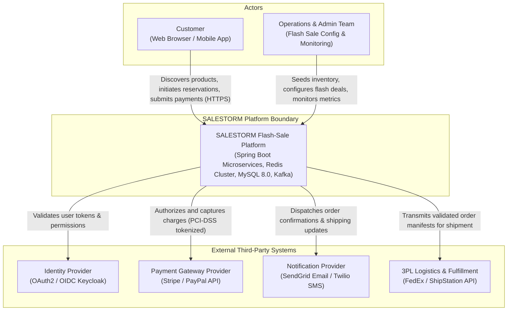
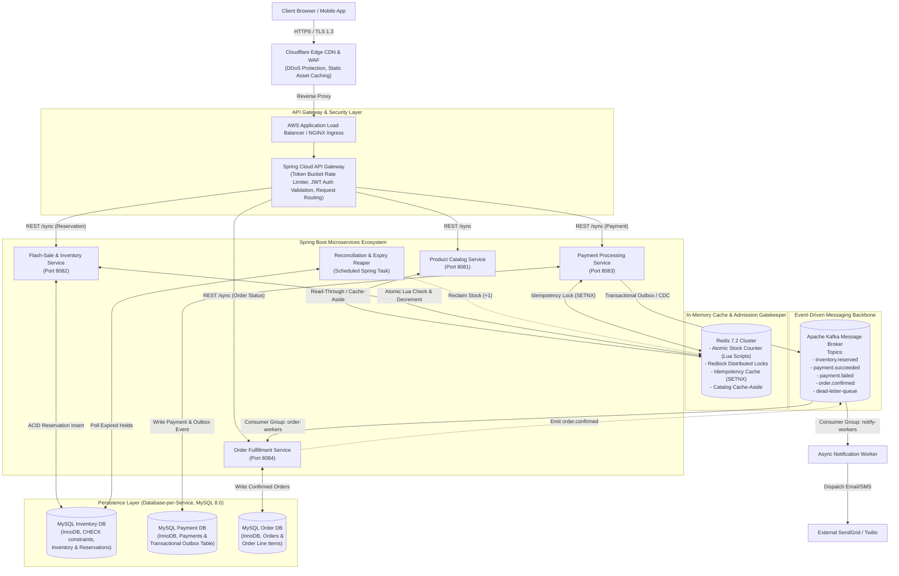
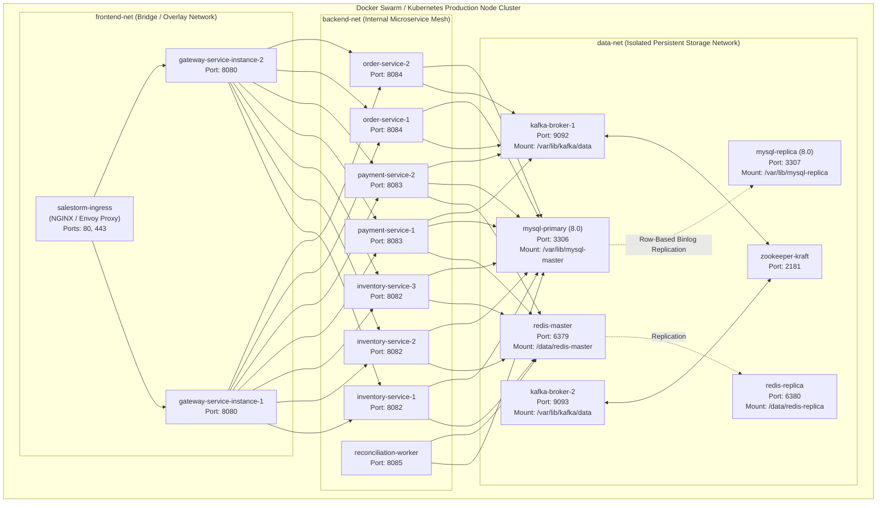

# 02. High-Level Architecture (HLD)

**Project:** SALESTORM Flash-Sale Platform  
**Phase:** Stage 2 — Architecture & High-Level Design  
**Author:** Principal System Architect  

---

## 1. System Context Diagram (C4 Level 1)

The System Context diagram describes SALESTORM's position within the enterprise ecosystem, its user personas, and its external third-party dependencies.

---

## 2. Container & Service Architecture Diagram (C4 Level 2)

The container diagram illustrates the microservice decomposition, data persistence boundaries, caching layers, and asynchronous messaging topologies.

---

## 3. Component Justifications & Bottleneck Analysis

| Component | Primary Architectural Purpose | Potential Bottleneck Under 10k Concurrency | Mitigation Strategy |
| :--- | :--- | :--- | :--- |
| **Cloudflare CDN & Edge WAF** | Absorbs static catalog traffic, blocks malicious scrapers, terminates TLS at edge. | Edge cache misses during price updates. | High TTL for static catalog data with instant webhook-based purge on price/stock mutation. |
| **Spring Cloud API Gateway** | Centralized ingress routing, JWT token extraction, and token-bucket rate limiting. | Netty event loop thread saturation under request surges. | Horizontal Autoscaling (HPA), non-blocking reactive filters, short request timeout limits (2s). |
| **Redis 7.2 Cluster** | **Primary Traffic Gatekeeper**: Executes atomic Lua check-and-decrement in $< 0.3\text{ ms}$, filtering 99% of requests in memory. | Single Redis shard CPU saturation or network I/O limits. | Single-key Lua script benchmarked at $> 120,000\text{ ops/sec}$. Cluster sharding with read replicas for status reads. |
| **Flash-Sale Inventory Service** | Validates customer limits and persists reservation holds into MySQL. | HikariCP database connection pool exhaustion if 10k threads hit MySQL simultaneously. | **Two-Tier Architecture**: Only the 100 requests granted by Redis ever enter MySQL; remaining 9,900 are fast-rejected. |
| **Payment Service** | Idempotently coordinates with third-party payment gateways; uses Transactional Outbox. | External Stripe latency (800ms) causing thread blocking. | Non-blocking HTTP client (WebClient), Resilience4j circuit breaker, and async event dispatch. |
| **Apache Kafka Broker** | Buffers high-volume events, decouples Payment from Order Service, prevents data loss during outages. | Consumer lag during downstream crashes or partition hot-spotting. | Partitioning by `customer_id`, durable SSD log segments, consumer auto-recovery upon restart. |
| **MySQL 8.0 Primary-Replica** | Systems of record for financial auditability, ACID transactions, and hardware CHECK constraints. | Lock contention and disk I/O on single product row. | Row-level locking scoped strictly to 100 transactions; read replicas offload all reporting traffic. |

---

## 4. Communication Protocols: Synchronous vs. Asynchronous Matrix

| Service Boundary | Protocol | Pattern | Justification |
| :--- | :--- | :--- | :--- |
| **Client $\rightarrow$ API Gateway** | HTTPS / TLS 1.3 | Synchronous REST | Client requires immediate synchronous feedback (reservation token or out-of-stock notification). |
| **Gateway $\rightarrow$ Inventory Service** | HTTP/2 REST | Synchronous Request-Response | Strict hold guarantee: Client must immediately obtain `reservation_id` or 409 Conflict. |
| **Inventory $\rightarrow$ Redis** | RESP3 TCP | Synchronous Atomic Lua | Redis executes in $< 1\text{ ms}$; atomic serial execution guarantees zero overselling. |
| **Inventory $\rightarrow$ MySQL** | JDBC (HikariCP) | Synchronous ACID Transaction | Guarantees durable persistent reservation before client proceeds to payment. |
| **Payment $\rightarrow$ External Gateway** | HTTPS REST | Synchronous with Circuit Breaker | Financial authorization requires authoritative external confirmation. |
| **Payment $\rightarrow$ Order Service** | Apache Kafka | **Asynchronous Event-Driven Saga** | **Decouples services**: If Order Service is down for 30s, Payment completes without error; Order consumes event on recovery. |
| **Order $\rightarrow$ Notification** | Apache Kafka | Asynchronous Publish-Subscribe | Customer notification must not block the core checkout execution critical path. |

---

## 5. Docker-Based Deployment Architecture

The following deployment topology isolates internal networks, configures multi-replica services, and provides durable volume mounts.

---

## 6. Scaling to $50\times$ Traffic Surge ($500,000\text{ req/s}$)

If inbound traffic surges by $50\times$ (from 10,000 to 500,000 requests per second):
1. **Edge Offloading:** Cloudflare CDN serves cached static catalog pages and countdown timers directly from edge Points of Presence (PoPs), absorbing $95\%$ of read traffic.
2. **Gateway Tier Auto-Scaling:** Spring Cloud Gateway horizontally scales from 2 to 20 instances via Kubernetes Horizontal Pod Autoscaler (HPA) targeting $70\%$ CPU utilization.
3. **Redis Cluster Partitioning:** Redis stock keys are pre-sharded across multiple hash slots. Single-threaded Lua script throughput scales linearly across cluster nodes.
4. **Fast-Drop Gate:** The moment Redis stock reaches 0, the API Gateway immediately enables an in-memory circuit breaker flag (`LOCAL_STOCK_DEPLETED = true`), returning HTTP 409 responses at the gateway layer without generating any downstream network hops.
