# 03. Low-Level Design (LLD)

**Project:** SALESTORM Flash-Sale Platform  
**Phase:** Stage 5 — Low-Level Object-Oriented Design  
**Author:** Principal System Architect  

---

## 1. Domain Class Diagram (Inventory, Payment, and Order Modules)

The low-level design structures the system into decoupled domain aggregates, repositories, and polymorphic strategy providers.

```mermaid
classDiagram
    %% ================= INVENTORY MODULE =================
    class Inventory {
        -Long inventoryId
        -Long productId
        -int totalQuantity
        -int availableQuantity
        -int reservedQuantity
        -int soldQuantity
        -Long version
        +boolean hasAvailableStock(int qty)
        +void reserve(int qty)
        +void confirm(int qty)
        +void release(int qty)
    }

    class InventoryReservation {
        -String reservationId
        -Long productId
        -Long customerId
        -int quantity
        -ReservationStatus status
        -String idempotencyKey
        -Instant expiresAt
        -Instant createdAt
        +boolean isExpired()
        +void transitionTo(ReservationStatus newStatus)
    }

    class ReservationStatus {
        <<enumeration>>
        AVAILABLE
        RESERVED
        PAYMENT_PENDING
        CONFIRMED
        SOLD
        RELEASED
        EXPIRED
    }

    class InventoryService {
        -RedisTemplate redisTemplate
        -InventoryRepository inventoryRepo
        -ReservationRepository reservationRepo
        +ReservationResult createReservation(Long customerId, Long prodId, String idemKey)
        +void releaseReservation(String reservationId)
        +void confirmReservation(String reservationId)
    }

    class InventoryRepository {
        <<interface>>
        +Optional~Inventory~ findByProductId(Long productId)
        +int decrementAvailableAndIncrementReserved(Long productId, int qty)
        +int releaseReservedToAvailable(Long productId, int qty)
        +int transitionReservedToSold(Long productId, int qty)
    }

    class ReservationRepository {
        <<interface>>
        +Optional~InventoryReservation~ findById(String reservationId)
        +Optional~InventoryReservation~ findByIdempotencyKey(String key)
        +List~InventoryReservation~ findExpiredReservations(Instant now)
        +InventoryReservation save(InventoryReservation reservation)
    }

    %% ================= PAYMENT MODULE =================
    class Payment {
        -String paymentId
        -String orderId
        -String reservationId
        -Long customerId
        -BigDecimal amount
        -String currency
        -PaymentStatus status
        -String paymentProvider
        -String providerTxId
        -String idempotencyKey
        +void markSuccess(String providerTxId)
        +void markFailed(String reason)
    }

    class PaymentStatus {
        <<enumeration>>
        PENDING
        SUCCESS
        FAILED
        TIMED_OUT
        REFUNDED
    }

    class PaymentProcessingService {
        -PaymentStrategyFactory strategyFactory
        -PaymentRepository paymentRepo
        -TransactionalOutboxRepository outboxRepo
        -CircuitBreaker circuitBreaker
        +PaymentResult processPayment(PaymentCommand command)
    }

    class PaymentGatewayStrategy {
        <<interface>>
        +ChargeResult charge(PaymentRequest request)
        +RefundResult refund(RefundRequest request)
    }

    class StripePaymentStrategy {
        -StripeRestClient restClient
        +ChargeResult charge(PaymentRequest request)
        +RefundResult refund(RefundRequest request)
    }

    class PayPalPaymentStrategy {
        -PayPalRestClient restClient
        +ChargeResult charge(PaymentRequest request)
        +RefundResult refund(RefundRequest request)
    }

    class MockPaymentStrategy {
        +ChargeResult charge(PaymentRequest request)
        +RefundResult refund(RefundRequest request)
    }

    class PaymentStrategyFactory {
        -Map~String, PaymentGatewayStrategy~ strategies
        +PaymentGatewayStrategy getStrategy(String providerName)
    }

    class TransactionalOutbox {
        -Long outboxId
        -String aggregateType
        -String aggregateId
        -String eventType
        -String payload
        -OutboxStatus status
        -Instant createdAt
    }

    %% ================= ORDER MODULE =================
    class Order {
        -String orderId
        -Long customerId
        -String reservationId
        -BigDecimal totalAmount
        -OrderStatus status
        -List~OrderItem~ items
        -OrderState currentState
        +void setState(OrderState state)
        +void advanceState()
        +void cancel()
    }

    class OrderItem {
        -Long orderItemId
        -String orderId
        -Long productId
        -int quantity
        -BigDecimal unitPrice
    }

    class OrderState {
        <<interface>>
        +void handle(Order context)
        +String getStateName()
    }

    class CreatedOrderState {
        +void handle(Order context)
        +String getStateName()
    }

    class ConfirmedOrderState {
        +void handle(Order context)
        +String getStateName()
    }

    class ProcessingOrderState {
        +void handle(Order context)
        +String getStateName()
    }

    class OrderFulfillmentService {
        -OrderRepository orderRepo
        -KafkaTemplate kafkaTemplate
        +Order handlePaymentSucceeded(PaymentSucceededEvent event)
        +void updateOrderStatus(String orderId, OrderStatus newStatus)
    }

    class OrderRepository {
        <<interface>>
        +Optional~Order~ findById(String orderId)
        +Optional~Order~ findByReservationId(String reservationId)
        +Order save(Order order)
    }

    %% Module Relationships
    Inventory "1" *-- "0..*" InventoryReservation
    InventoryReservation --> ReservationStatus
    InventoryService --> InventoryRepository
    InventoryService --> ReservationRepository

    PaymentProcessingService --> PaymentStrategyFactory
    PaymentProcessingService --> PaymentGatewayStrategy
    PaymentProcessingService --> Payment
    PaymentProcessingService --> TransactionalOutbox
    StripePaymentStrategy ..|> PaymentGatewayStrategy
    PayPalPaymentStrategy ..|> PaymentGatewayStrategy
    MockPaymentStrategy ..|> PaymentGatewayStrategy
    Payment --> PaymentStatus

    Order "1" *-- "1..*" OrderItem
    Order --> OrderState
    CreatedOrderState ..|> OrderState
    ConfirmedOrderState ..|> OrderState
    ProcessingOrderState ..|> OrderState
    OrderFulfillmentService --> OrderRepository
    OrderFulfillmentService --> Order
```

---

## 2. Module Responsibilities & Domain Invariants

### 2.1 Inventory Domain
- **Aggregate Root:** `Inventory` represents the authoritative physical quantity of a SKU.
- **Invariant 1:** $available\_quantity + reserved\_quantity + sold\_quantity = total\_quantity$ at all times.
- **Invariant 2:** $available\_quantity \ge 0$ (enforced by code and MySQL hardware `CHECK` constraint).
- **Invariant 3:** Exactly one active reservation exists per customer for a given flash-sale product.

### 2.2 Payment Domain
- **Aggregate Root:** `Payment` models the financial authorization transaction.
- **Invariant 1:** A payment cannot be captured without an active, unexpired `reservation_id`.
- **Invariant 2:** Exact-Once processing is enforced by validating `idempotency_key`. A duplicate payment request never initiates a second charge to an external payment processor.
- **Invariant 3:** The payment record and its corresponding `TransactionalOutbox` domain event are committed inside the exact same local ACID transaction.

### 2.3 Order Domain
- **Aggregate Root:** `Order` represents the legal customer purchase contract.
- **Invariant 1:** An order cannot transition to `CONFIRMED` unless backed by a verified `payment_id` and valid `reservation_id`.
- **Invariant 2:** Order creation is strictly idempotent: re-delivering a `PaymentSucceededEvent` from Kafka produces the existing order rather than creating duplicate orders.

---

## 3. Error Handling and Validation Architecture

1. **Fast-Fail Layer (JSR-380 / Bean Validation):** Incoming DTOs are validated at controller boundary (`@NotNull`, `@Positive`, `@Pattern(regexp = "^[0-9a-fA-F-]{36}$")`).
2. **Business Exception Hierarchy:**
   - `OutOfStockException` $\rightarrow$ Mapped to `HTTP 409 Conflict`.
   - `DuplicateRequestException` $\rightarrow$ Mapped to `HTTP 409 Conflict` or replay cached response.
   - `PaymentFailedException` $\rightarrow$ Mapped to `HTTP 402 Payment Required`.
   - `ReservationExpiredException` $\rightarrow$ Mapped to `HTTP 410 Gone`.
3. **Global Controller Advice:** Returns standard **RFC 7807 Problem Details** for HTTP APIs.
