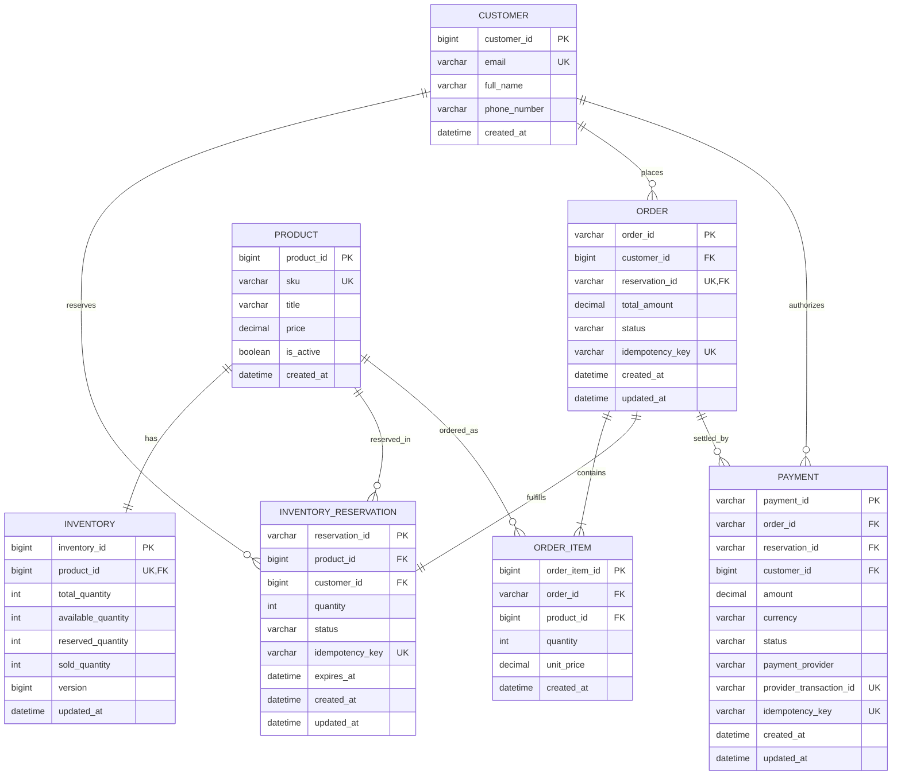

# 04. Database & Concurrency Design

**Project:** SALESTORM Flash-Sale Platform  
**Phase:** Stage 3 — Concurrency & Database Architecture  
**Author:** Principal System Architect  

---

## 1. Entity-Relationship Diagram (ERD)



---

## 2. DDL, Constraints, and Indexing Strategies

### 2.1 INVENTORY Table Schema
```sql
CREATE TABLE inventory (
    inventory_id BIGINT AUTO_INCREMENT PRIMARY KEY,
    product_id BIGINT NOT NULL,
    total_quantity INT NOT NULL,
    available_quantity INT NOT NULL,
    reserved_quantity INT NOT NULL DEFAULT 0,
    sold_quantity INT NOT NULL DEFAULT 0,
    version BIGINT NOT NULL DEFAULT 0,
    updated_at TIMESTAMP NOT NULL DEFAULT CURRENT_TIMESTAMP ON UPDATE CURRENT_TIMESTAMP,
    CONSTRAINT uq_inventory_product UNIQUE (product_id),
    CONSTRAINT chk_available_positive CHECK (available_quantity >= 0),
    CONSTRAINT chk_reserved_positive CHECK (reserved_quantity >= 0),
    CONSTRAINT chk_sold_positive CHECK (sold_quantity >= 0),
    CONSTRAINT chk_quantity_balance CHECK (available_quantity + reserved_quantity + sold_quantity = total_quantity)
) ENGINE=InnoDB DEFAULT CHARSET=utf8mb4 COLLATE=utf8mb4_unicode_ci;

CREATE INDEX idx_inventory_lookup ON inventory (product_id, available_quantity);
```

### 2.2 INVENTORY_RESERVATION Table Schema
```sql
CREATE TABLE inventory_reservation (
    reservation_id VARCHAR(36) NOT NULL PRIMARY KEY,
    product_id BIGINT NOT NULL,
    customer_id BIGINT NOT NULL,
    quantity INT NOT NULL DEFAULT 1,
    status ENUM('RESERVED', 'PAYMENT_PENDING', 'CONFIRMED', 'RELEASED', 'EXPIRED') NOT NULL DEFAULT 'RESERVED',
    idempotency_key VARCHAR(64) NOT NULL,
    expires_at DATETIME NOT NULL,
    created_at TIMESTAMP NOT NULL DEFAULT CURRENT_TIMESTAMP,
    updated_at TIMESTAMP NOT NULL DEFAULT CURRENT_TIMESTAMP ON UPDATE CURRENT_TIMESTAMP,
    CONSTRAINT uq_reservation_idempotency UNIQUE (idempotency_key),
    CONSTRAINT uq_customer_product_active UNIQUE (customer_id, product_id, status),
    CONSTRAINT fk_reservation_inventory FOREIGN KEY (product_id) REFERENCES inventory(product_id),
    CONSTRAINT chk_reservation_qty CHECK (quantity > 0)
) ENGINE=InnoDB DEFAULT CHARSET=utf8mb4 COLLATE=utf8mb4_unicode_ci;

-- Optimized Composite Index for Background Expiry Reaper Job
CREATE INDEX idx_reservation_reaper ON inventory_reservation (status, expires_at);
CREATE INDEX idx_reservation_customer ON inventory_reservation (customer_id, status);
```

### 2.3 PAYMENT & ORDER Schemas
```sql
CREATE TABLE payment (
    payment_id VARCHAR(36) NOT NULL PRIMARY KEY,
    order_id VARCHAR(36) NULL,
    reservation_id VARCHAR(36) NOT NULL,
    customer_id BIGINT NOT NULL,
    amount DECIMAL(10, 2) NOT NULL,
    currency VARCHAR(3) NOT NULL DEFAULT 'USD',
    status ENUM('PENDING', 'SUCCESS', 'FAILED', 'TIMED_OUT', 'REFUNDED') NOT NULL,
    payment_provider VARCHAR(32) NOT NULL,
    provider_transaction_id VARCHAR(128) NULL,
    idempotency_key VARCHAR(64) NOT NULL,
    created_at TIMESTAMP NOT NULL DEFAULT CURRENT_TIMESTAMP,
    updated_at TIMESTAMP NOT NULL DEFAULT CURRENT_TIMESTAMP ON UPDATE CURRENT_TIMESTAMP,
    CONSTRAINT uq_payment_idempotency UNIQUE (idempotency_key),
    CONSTRAINT uq_provider_tx UNIQUE (provider_transaction_id),
    CONSTRAINT chk_payment_amount CHECK (amount > 0.00)
) ENGINE=InnoDB DEFAULT CHARSET=utf8mb4 COLLATE=utf8mb4_unicode_ci;

CREATE INDEX idx_payment_reservation ON payment (reservation_id, status);

CREATE TABLE orders (
    order_id VARCHAR(36) NOT NULL PRIMARY KEY,
    customer_id BIGINT NOT NULL,
    reservation_id VARCHAR(36) NOT NULL,
    total_amount DECIMAL(10, 2) NOT NULL,
    status ENUM('CREATED', 'CONFIRMED', 'PROCESSING', 'SHIPPED', 'DELIVERED', 'CANCELLED') NOT NULL DEFAULT 'CREATED',
    idempotency_key VARCHAR(64) NOT NULL,
    created_at TIMESTAMP NOT NULL DEFAULT CURRENT_TIMESTAMP,
    updated_at TIMESTAMP NOT NULL DEFAULT CURRENT_TIMESTAMP ON UPDATE CURRENT_TIMESTAMP,
    CONSTRAINT uq_order_reservation UNIQUE (reservation_id),
    CONSTRAINT uq_order_idempotency UNIQUE (idempotency_key)
) ENGINE=InnoDB DEFAULT CHARSET=utf8mb4 COLLATE=utf8mb4_unicode_ci;
```

---

## 3. Concurrency-Safe Reservation Analysis: Pessimistic vs. Optimistic Locking

### 3.1 The 10,000-User Contention Problem
When 10,000 customers click "Buy Now" at the exact same second for 100 units of Product X, all 10,000 application worker threads attempt to modify the identical row in the `inventory` table (`product_id = 100`).

```
                    ┌────────────────────────┐
                    │ 10,000 Inbound Requests│
                    └───────────┬────────────┘
                                │
        ┌───────────────────────┴───────────────────────┐
        ▼                                               ▼
[Approach A: Pessimistic Lock]              [Approach B: Optimistic Lock]
`SELECT ... FOR UPDATE`                     `UPDATE ... WHERE version = ?`
- InnoDB exclusive row lock                 - 1 request updates version (0->1)
- 9,999 threads queue behind lock           - 9,999 requests fail immediately
- HikariCP connection pool exhausted        - Retry loop triggers THUNDERING HERD
- Lock wait timeouts & thread thrashing     - Massive CPU saturation & 99.9% aborts
```

### 3.2 Deep Comparison Matrix

| Evaluation Dimension | Approach A: Pessimistic Locking (`SELECT FOR UPDATE`) | Approach B: Optimistic Locking (`version` field) | Approach C: Direct Atomic DB Decrement (`WHERE available >= 1`) | Approach D (Selected): Two-Tier Concurrency (Redis Lua + MySQL ACID) |
| :--- | :--- | :--- | :--- | :--- |
| **SQL Implementation** | `SELECT available_quantity FROM inventory WHERE product_id = 100 FOR UPDATE;`<br>`UPDATE inventory SET available_quantity = available_quantity - 1 WHERE product_id = 100;` | `SELECT version, available_quantity FROM inventory WHERE product_id = 100;`<br>`UPDATE inventory SET available_quantity = available_quantity - 1, version = version + 1 WHERE product_id = 100 AND version = :version;` | `UPDATE inventory SET available_quantity = available_quantity - 1, reserved_quantity = reserved_quantity + 1 WHERE product_id = 100 AND available_quantity >= 1;` | **Tier 1:** Redis Lua Atomic Admission.<br>**Tier 2:** Transactional MySQL insert for granted tokens. |
| **Locking Mechanics** | InnoDB acquires Exclusive (X) Row Lock on the primary index record. | No database lock acquired during read. Version check checked on write. | InnoDB acquires row lock only during the atomic `UPDATE` execution. | In-memory atomic single-threaded execution. No database locks for 9,900 rejected requests. |
| **10,000 Thread Behavior** | Threads serialize on row lock. 50 threads acquire connections; 9,950 wait in OS thread queue. | 1 thread succeeds per version increment. 9,999 threads fail immediately with `OptimisticLockException`. | All 10,000 threads queue sequentially on the row update lock. | 9,900 requests fail in memory within $< 1\text{ ms}$. Exactly 100 requests proceed to MySQL. |
| **Connection Pool Impact** | **Severe:** HikariCP pool exhausted immediately. Connection timeout errors cascade to all APIs. | **Severe:** If retries are configured, a "Retry Storm" saturates connections and CPU. | **Moderate-High:** Pool remains saturated while all 10,000 updates serialize. | **Negligible:** Only 100 transactions are submitted to MySQL over 500ms. Hikari pool stays $< 20\%$ utilized. |
| **Throughput / Latency** | Throughput collapses to $< 50\text{ req/s}$. P99 Latency $> 15,000\text{ ms}$. | High CPU thrashing. P99 Latency $> 8,000\text{ ms}$ on retries. | Throughput $\approx 400\text{ req/s}$. P99 Latency $> 3,500\text{ ms}$. | **P99 Latency $< 45\text{ ms}$. Fast 409 rejection for 99% of requests.** |
| **Overselling Risk** | 0% (Zero oversell). | 0% (Zero oversell). | 0% (Zero oversell). | **0% (Guaranteed by Redis single-thread Lua + MySQL CHECK constraint).** |

### 3.3 Architectural Justification of Selected Approach
Directly exposing MySQL to 10,000 concurrent threads competing for a single row is mathematically unviable for sub-second flash sales. 

We select **Approach D (Two-Tier Concurrency Control)**:
1. **Tier 1 (Traffic Gatekeeper in Redis):** A single-threaded Redis Lua script atomically decrements the stock counter in memory. It grants exactly 100 reservation tokens and rejects the remaining 9,900 requests immediately with HTTP 409 (Sold Out).
2. **Tier 2 (Durable Persistence in MySQL):** Only the 100 successful tokens are passed to Spring Boot to insert the persistent `INVENTORY_RESERVATION` record into MySQL within an isolated transaction.

---

## 4. Strict Transaction Boundaries

To prevent database deadlocks and thread pool exhaustion, the following strict transaction rules are enforced:

```java
@Service
public class InventoryReservationService {

    @Autowired private RedisTemplate<String, String> redisTemplate;
    @Autowired private InventoryRepository inventoryRepository;
    @Autowired private ReservationRepository reservationRepository;

    // STEP 1: Entry Point (NON-TRANSACTIONAL to avoid holding DB connections during cache checks)
    public ReservationResult reserve(ReservationRequest request) {
        // Fast-fail in-memory admission check (Redis Lua)
        LuaAdmissionResult result = executeRedisLuaAdmission(request);
        if (!result.isGranted()) {
            throw new OutOfStockException("Flash sale item is fully booked.");
        }

        // STEP 2: Scoped DB Transaction (strictly limited to local DB writes)
        try {
            return executeTransactionalSettlement(request, result.getReservationId());
        } catch (Exception ex) {
            // Defensive Compensation: If DB write fails, release token back to Redis
            reclaimRedisStock(request.getProductId());
            throw new PersistenceFailedException("Could not persist reservation", ex);
        }
    }

    // STRICT TRANSACTION BOUNDARY
    // Isolation: READ_COMMITTED prevents dirty reads without the locking overhead of REPEATABLE READ
    // Timeout: 3 seconds (fail-fast guarantee)
    // CRITICAL: NO external HTTP calls (Payment Gateway, Emails) allowed inside this method!
    @Transactional(
        isolation = Isolation.READ_COMMITTED, 
        timeout = 3, 
        propagation = Propagation.REQUIRED
    )
    public ReservationResult executeTransactionalSettlement(ReservationRequest req, String reservationId) {
        // Atomic DB decrement acting as secondary defense
        int affected = inventoryRepository.decrementAvailableAndIncrementReserved(req.getProductId(), 1);
        if (affected == 0) {
            throw new InventoryInconsistencyException("Database stock invariant violated.");
        }

        InventoryReservation reservation = new InventoryReservation(
            reservationId, req.getProductId(), req.getCustomerId(),
            1, ReservationStatus.RESERVED, req.getIdempotencyKey(),
            Instant.now().plusSeconds(600)
        );
        reservationRepository.save(reservation);

        return new ReservationResult(reservationId, "RESERVED", reservation.getExpiresAt());
    }
}
```
