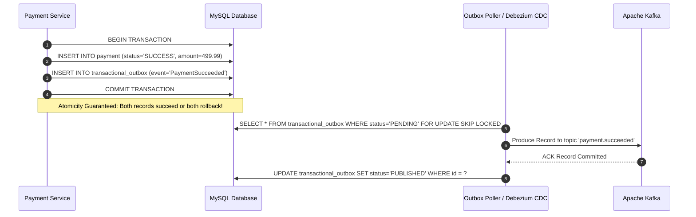

# 07. Design Patterns & Architectural Idioms

**Project:** SALESTORM Flash-Sale Platform  
**Phase:** Stage 6 — Gang of Four & Cloud Design Patterns  
**Author:** Principal System Architect  

---

## 1. Selected Design Patterns Matrix

| Pattern | Architectural Location | Concrete SALESTORM Application | Problem Solved | Trade-Off Introduced |
| :--- | :--- | :--- | :--- | :--- |
| **Strategy Pattern** | Payment Service | `PaymentGatewayStrategy` with `StripePaymentStrategy`, `PayPalPaymentStrategy`, `MockPaymentStrategy`. | Encapsulates third-party vendor variations behind a uniform API. | Additional layer of interface indirection; requires factory lookup. |
| **State Pattern** | Order & Inventory Modules | `ReservationState` and `OrderState` managing lifecycle progression. | Eliminates complex, error-prone nested `if-else` or `switch` statements across states. | Class explosion (each state requires a distinct class implementation). |
| **Circuit Breaker Pattern** | External Gateways | `Resilience4jCircuitBreaker` wrapping Stripe/PayPal HTTP calls. | Prevents thread starvation and cascading system failures when third-party gateways hang. | Legitimate user requests fail fast when circuit is OPEN; requires fallback mechanisms. |
| **Factory Pattern** | Payment Service | `PaymentStrategyFactory` resolving beans by provider token. | Centralizes creation and registration of payment strategy instances. | Compile-time coupling to provider token registry. |
| **Transactional Outbox** | Payment & Order Modules | `TransactionalOutbox` entity written in same ACID transaction. | Eliminates dual-write inconsistencies between MySQL and Kafka without slow 2PC. | Requires background poller or CDC daemon (Debezium) to tail binlogs. |
| **Repository Pattern** | Data Access Layer | `InventoryRepository`, `PaymentRepository`, `OrderRepository`. | Decouples domain logic from underlying persistence mechanisms (JPA/Hibernate/JDBC). | Memory overhead of abstraction mapping layers (DTO to Entity). |

---

## 2. In-Depth Pattern Implementations

### 2.1 Strategy & Factory Patterns: Pluggable Payment Gateways

```java
// STRATEGY CONTRACT
public interface PaymentGatewayStrategy {
    ChargeResult charge(PaymentRequest request);
    RefundResult refund(RefundRequest request);
}

// FACTORY
@Component
public class PaymentStrategyFactory {
    private final Map<String, PaymentGatewayStrategy> strategies;

    @Autowired
    public PaymentStrategyFactory(Map<String, PaymentGatewayStrategy> strategies) {
        this.strategies = strategies;
    }

    public PaymentGatewayStrategy getStrategy(String providerName) {
        PaymentGatewayStrategy strategy = strategies.get(providerName.toUpperCase() + "_STRATEGY");
        if (strategy == null) {
            throw new UnsupportedPaymentProviderException("Provider not supported: " + providerName);
        }
        return strategy;
    }
}
```

---

### 2.2 State Pattern: Reservation & Order Lifecycle

The State Pattern enforces strict transition rules. Any invalid state mutation throws an `IllegalStateTransitionException`:

```java
public interface OrderState {
    void confirm(Order context);
    void process(Order context);
    void ship(Order context, String trackingNumber);
    void cancel(Order context, String reason);
}

public class CreatedOrderState implements OrderState {
    @Override
    public void confirm(Order context) {
        context.setState(new ConfirmedOrderState());
        context.setStatus(OrderStatus.CONFIRMED);
    }

    @Override
    public void process(Order context) {
        throw new IllegalStateTransitionException("Cannot process an unconfirmed order.");
    }

    @Override
    public void ship(Order context, String trackingNumber) {
        throw new IllegalStateTransitionException("Cannot ship an unconfirmed order.");
    }

    @Override
    public void cancel(Order context, String reason) {
        context.setState(new CancelledOrderState(reason));
        context.setStatus(OrderStatus.CANCELLED);
    }
}
```

---

### 2.3 Circuit Breaker Pattern (Resilience4j)

External payment gateways can experience sudden network drops or rate limiting. The Circuit Breaker protects worker threads:

```java
@Component
public class ResilientPaymentGatewayWrapper implements PaymentGatewayStrategy {

    private final PaymentGatewayStrategy delegate;
    private final CircuitBreaker circuitBreaker;

    public ResilientPaymentGatewayWrapper(
            PaymentGatewayStrategy delegate, 
            CircuitBreakerRegistry registry) {
        this.delegate = delegate;
        this.circuitBreaker = registry.circuitBreaker("payment-gateway-cb", CircuitBreakerConfig.custom()
            .failureRateThreshold(50.0f) // Trip if 50% of requests fail
            .slidingWindowSize(20)       // Over the last 20 requests
            .waitDurationInOpenState(Duration.ofSeconds(10)) // Stay OPEN for 10 seconds
            .permittedNumberOfCallsInHalfOpenState(5)
            .build());
    }

    @Override
    public ChargeResult charge(PaymentRequest request) {
        return circuitBreaker.executeSupplier(() -> delegate.charge(request));
    }

    @Override
    public RefundResult refund(RefundRequest request) {
        return circuitBreaker.executeSupplier(() -> delegate.refund(request));
    }
}
```

---

### 2.4 Transactional Outbox Pattern

The Transactional Outbox pattern guarantees that a message is sent to Apache Kafka **if and only if** the local database transaction successfully commits.


