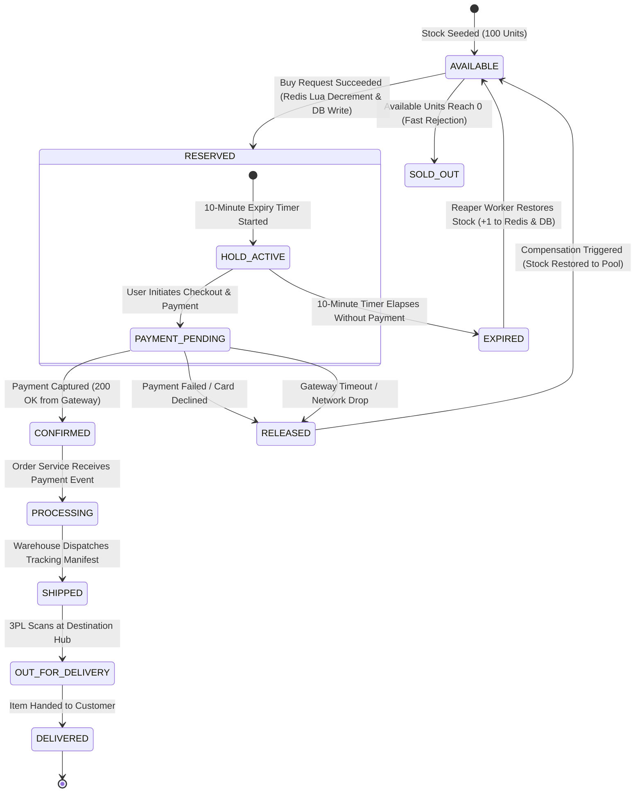
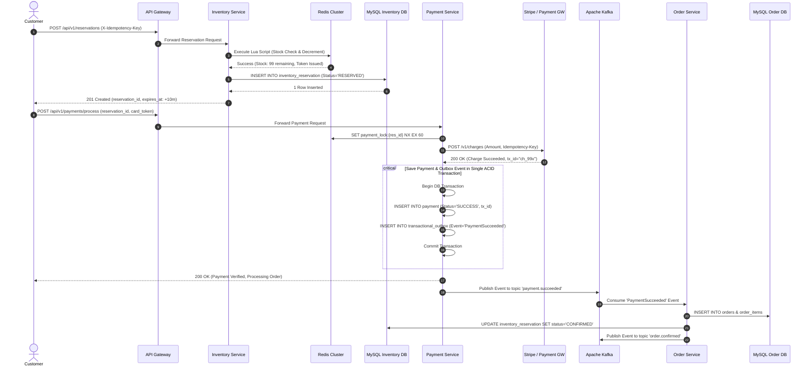
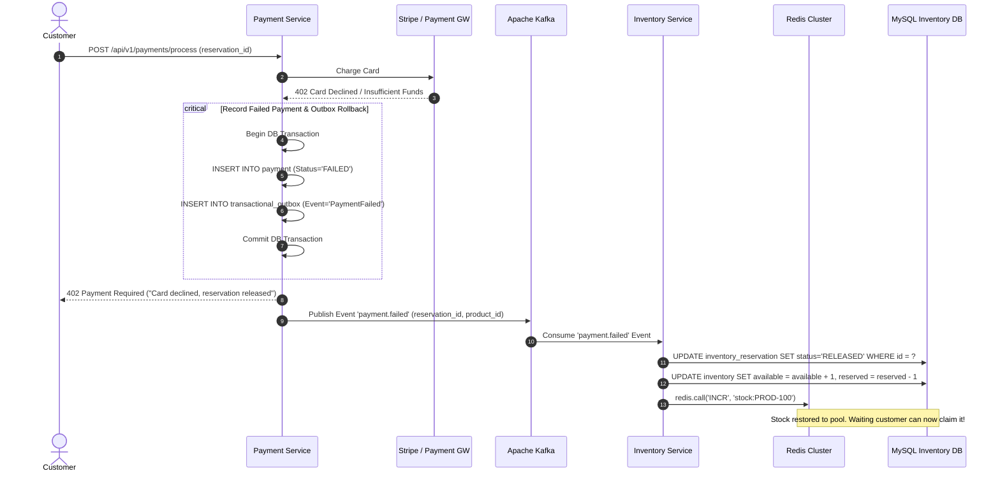
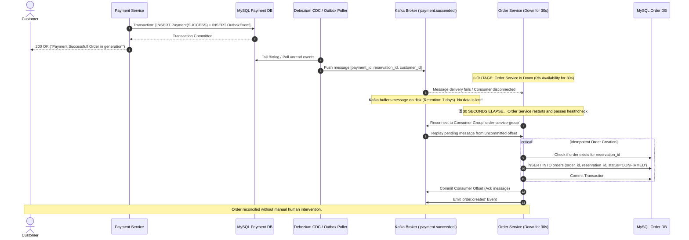

# 08. Scalability, Reliability & Critical Workflows

**Project:** SALESTORM Flash-Sale Platform  
**Phase:** Stage 4 & Stage 8 — Resilience, High Availability & Workflow Verification  
**Author:** Principal System Architect  

---

## 1. Complete Reservation & Order State Transition Diagram



---

## 2. Sequence Diagrams for Critical Purchase Workflows

### 2.1 Flow 1: Successful Purchase Flow (Request to Order Confirmation)



---

### 2.2 Flow 2: Payment Failure Triggering Reservation Release



---

### 2.3 Flow 3: Payment Success Followed by Temporary Order Service Failure (30s Downtime)

This workflow verifies system survival when the Order Service crashes for 30 seconds immediately after payment authorization.



---

## 3. Asynchronous Resilience & Reconciliation Architecture

### 3.1 Retry & Backoff Strategy
For non-fatal errors (transient network drops), consumers adhere to an exponential backoff formula:
$$t_{\text{wait}} = \min(t_{\text{max}}, t_{\text{base}} \times 2^{\text{retry\_count}}) \pm \text{jitter}$$
- Base delay: $500\text{ ms}$; Multiplier: $2.0$; Max retries: 3.
- If all 3 retries fail, messages are diverted to a dedicated Dead-Letter Queue (DLQ): `order-service.DLQ`.

### 3.2 Scheduled Reconciliation Worker (Fail-Safe Reaper)
A background Spring Scheduled task runs every 10 seconds to detect orphaned holds or desynchronized stock:
```java
@Component
public class ReservationReconciliationReaper {

    @Autowired private ReservationRepository reservationRepo;
    @Autowired private InventoryRepository inventoryRepo;
    @Autowired private RedisTemplate<String, String> redisTemplate;

    @Scheduled(fixedRate = 10000)
    @Transactional
    public void sweepExpiredReservations() {
        Instant now = Instant.now();
        List<InventoryReservation> expired = reservationRepo.findExpiredReservations(now);

        for (InventoryReservation res : expired) {
            res.transitionTo(ReservationStatus.EXPIRED);
            reservationRepo.save(res);

            // Reclaim stock in MySQL
            inventoryRepo.releaseReservedToAvailable(res.getProductId(), res.getQuantity());

            // Reclaim stock in Redis
            redisTemplate.opsForValue().increment("stock:" + res.getProductId(), res.getQuantity());
        }
    }
}
```
