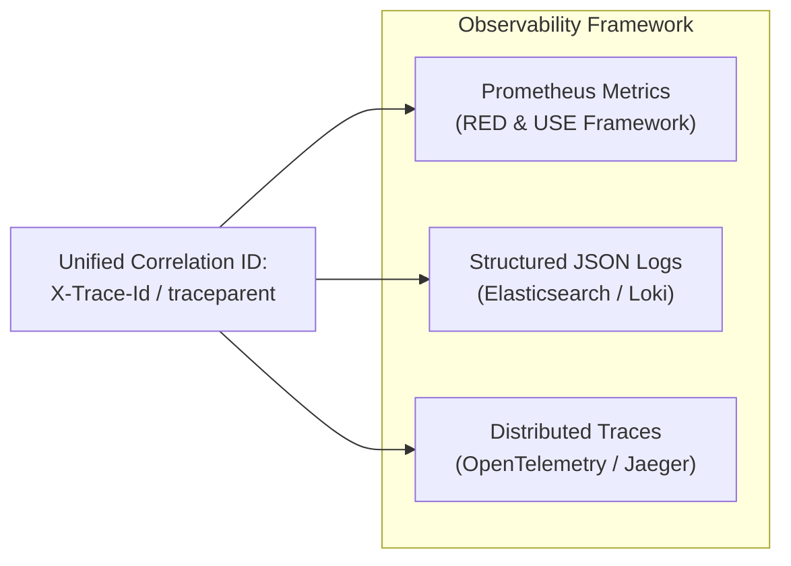

# 09. Security & Observability Strategy

**Project:** SALESTORM Flash-Sale Platform  
**Phase:** Stage 10 — Security Architecture & Production Observability  
**Author:** Principal System Architect  

---

## 1. Security Architecture & Threat Mitigation

| Threat Vector | Mitigation Architecture | Technical Implementation |
| :--- | :--- | :--- |
| **DDoS & Flash Traffic Surges** | Cloudflare Edge WAF + Rate Limiting. | Blocks automated bot scrapers, challenges suspicious IP ASN ranges with Managed Challenges. |
| **Credential Hijacking / Impersonation** | Stateless OAuth2 / OpenID Connect with short-lived JWTs. | Gateway validates cryptographic signature of RS256 JWT tokens. Claims include `user_id` and verified email. |
| **SQL Injection & Data Tampering** | Parameterized queries and ORM boundaries. | Spring Data JPA / Hibernate strictly prohibits raw string-concatenated SQL queries. |
| **Payment Card Theft (PCI-DSS)** | Tokenization at the browser layer. | Raw credit card numbers NEVER touch SALESTORM servers. The browser sends card numbers directly to Stripe Elements, receiving a single-use token (`tok_1234`). |
| **Internal Eavesdropping** | Mutual TLS (mTLS) across internal service mesh. | Envoy / Istio sidecars enforce TLS 1.3 encryption between all microservices and databases. |

---

## 2. Observability Strategy: Metrics, Logs & Tracing

### 2.1 The Three Pillars of Observability



### 2.2 Golden Metrics & Alerting Thresholds

| Metric Name | Type | Labels / Tags | Critical Alert Condition | Action / Playbook |
| :--- | :--- | :--- | :--- | :--- |
| `flashsale_reservation_requests_total` | Counter | `status="granted|rejected|duplicate"` | $> 5000\text{ req/s}$ | Normal flash spike. Verify HPA scales pods. |
| `flashsale_inventory_remaining` | Gauge | `product_id="100"` | Drops to $0$ | Verify Gateway flips to fast-fail 409 mode. |
| `payment_gateway_duration_seconds` | Histogram | `provider="stripe"`, `quantile="0.99"` | P99 $> 3.0\text{ seconds}$ | Alert on-call. Circuit breaker trips if error rate $> 50\%$. |
| `kafka_consumer_lag_records` | Gauge | `topic="payment.succeeded"`, `group="order-service"` | Lag $> 50$ for $> 15\text{ s}$ | Detects Order Service outage; triggers auto-restart. |
| `hikaricp_active_connections` | Gauge | `pool="InventoryPool"` | Active $> 45$ (Pool max 50) | Investigates runaway database locks. |

---

## 3. Structured Logging Standard

All microservices emit single-line, machine-readable JSON logs to `stdout`, ingested by FluentBit into OpenSearch/Loki.

```json
{
  "timestamp": "2026-10-05T10:00:01.125Z",
  "level": "INFO",
  "service": "inventory-service",
  "traceId": "4bf92f3577b34da6a3ce929d0e0e4736",
  "spanId": "00f067aa0ba902b7",
  "thread": "http-nio-8082-exec-12",
  "eventType": "INVENTORY_RESERVATION_GRANTED",
  "customerId": 50123,
  "productId": 100,
  "reservationId": "res_8f7b2c14-5d9a-4c11-b921-3e28c7f99012",
  "executionDurationMs": 2.4,
  "remainingStock": 74,
  "message": "Atomic reservation granted via Redis Lua and queued for settlement."
}
```

---

## 4. Distributed Tracing Configuration

Distributed tracing conforms to the **W3C TraceContext** standard (`traceparent` header):
- Format: `00-4bf92f3577b34da6a3ce929d0e0e4736-00f067aa0ba902b7-01`
- Spring Cloud Gateway initiates the trace context upon ingress.
- OpenTelemetry instrumentation propagates the context across HTTP headers (`traceparent`) and Kafka message headers.
- Developers can visualize the entire checkout latency waterfall in Jaeger / Grafana Tempo.
