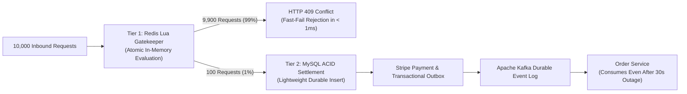

# 10. Architecture Decision Record (ADR-001)

**Title:** High-Concurrency Flash Sale Inventory Reservation and Order Settlement Architecture  
**Status:** Accepted  
**Date:** 2026-10-05  
**Author:** Principal System Architect  
**Reviewers:** SALESTORM Architecture Review Board  

---

## 1. Context & Problem Statement

SALESTORM is hosting a flash-sale event where **10,000 concurrent customers** click "Buy Now" at the exact same second ($t_0$) for **100 available units** of Product X. 

The architecture must satisfy the following critical constraints:
1. **Zero Overselling:** Under no circumstances may more than 100 units be sold ($available\_quantity \ge 0$).
2. **Prevent Connection Starvation:** Submitting 10,000 concurrent transactions directly to a single MySQL row locks threads and exhausts database connection pools (HikariCP max: 50).
3. **Exact-Once Payment Processing:** Duplicate requests (estimated at 2%) must never create duplicate charges.
4. **Downstream Fault Tolerance:** The platform must survive a temporary 30-second outage of the Order Service without dropping transactions or canceling paid orders.

---

## 2. Considered Alternatives

### Alternative 1: Monolithic MySQL with Pessimistic Locking (`SELECT ... FOR UPDATE`)
- **Description:** All 10,000 HTTP requests acquire an exclusive row lock in InnoDB.
- **Why Rejected:** Severe database thrashing. 50 HikariCP connections serialize, while 9,950 requests wait in the OS thread queue. Result: high lock-wait timeouts (`MySQL 1205`), thread pool starvation, and P99 latencies exceeding 15 seconds.

### Alternative 2: Optimistic Concurrency Control (`@Version` field in MySQL)
- **Description:** Every thread reads the version and attempts an atomic version update.
- **Why Rejected:** Under 10,000 concurrent updates on one row, 1 transaction succeeds and 9,999 fail immediately. Retrying these failures causes a catastrophic **"Retry Storm" (Thundering Herd)**, consuming 100% CPU on aborted transactions.

### Alternative 3: Distributed Two-Phase Commit (2PC / XA Transactions)
- **Description:** A synchronous transaction coordinator locks Inventory, Payment, and Order databases simultaneously.
- **Why Rejected:** 2PC blocks all participating resources until the slowest participant responds. If the Order Service crashes for 30 seconds, all 100 transactions hang indefinitely, locking database rows and freezing memory.

### Alternative 4 (Selected): Two-Tier Concurrency Architecture with In-Memory Lua Gatekeeper and Asynchronous Event-Driven Saga
- **Description:** 
  1. Redis executes an atomic Lua script in memory ($< 0.3\text{ ms}$). The first 100 requests receive a reservation token; 9,900 requests fail fast with HTTP 409.
  2. The 100 successful requests execute a durable, low-contention transaction in MySQL.
  3. Payment Service uses the **Transactional Outbox Pattern** to publish `PaymentSucceeded` events to **Apache Kafka**. Order Service processes the events asynchronously upon recovery.

---

## 3. Decision Outcome

We select **Alternative 4: Two-Tier Concurrency Control with Transactional Outbox and Kafka Saga**.

---

## 4. Explicit Trade-offs & Defended Rationale

### 4.1 Consistency vs. Availability (CAP Theorem)
- **Trade-Off:** At the **Inventory Reservation boundary**, we intentionally choose **Strong Consistency (CP)** over Availability. Once 100 units are reserved, all subsequent requests are rejected immediately.
- **Defense:** In retail flash sales, allowing "eventual consistency" on physical inventory creates severe overselling, legal exposure, and brand damage. Conversely, at the **Order Fulfillment boundary**, we choose **Eventual Consistency (AP)** using Kafka buffers, ensuring that paid transactions survive downstream downtime.

### 4.2 Synchronous Simplicity vs. Asynchronous Resilience
- **Trade-Off:** We sacrifice the architectural simplicity of synchronous REST calls between Payment and Order services in favor of an **Asynchronous Choreography Saga**.
- **Defense:** Synchronous HTTP calls couple availability zones. If the Order Service suffers a 30-second outage during peak checkout, synchronous calls fail or time out, leaving customers charged without confirmed orders. The asynchronous Outbox + Kafka log guarantees that zero orders are lost.

### 4.3 In-Memory Cache Dual-Write vs. Relational Reliability
- **Trade-Off:** Maintaining inventory counts in both Redis and MySQL introduces the potential for state divergence if a node crashes mid-flight.
- **Defense:** This trade-off is accepted to protect MySQL from catastrophic collapse. State divergence is actively mitigated through:
  1. Redis key TTLs matching reservation expiry (600s).
  2. Scheduled database reconciliation reaper jobs running every 10 seconds.
  3. MySQL InnoDB hardware-level `CHECK (available_quantity >= 0)` acting as the ultimate system of record.

---

## 5. Consequences & Operational Impact

- **Positive:** P99 latency remains $< 45\text{ ms}$ for 99% of users; zero database row lock contention; zero oversold inventory; zero lost orders during downstream failures.
- **Negative:** Increased infrastructure components (Redis Cluster, Apache Kafka brokers, Outbox poller daemons) requiring distributed tracing and automated alert monitoring.
